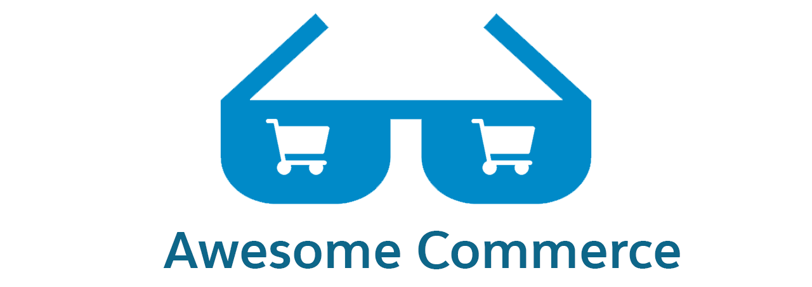

<h3>Introduction</h3>

This repository is a curated list of awesome guides, repositories & documentation to help you get started building a storefront using Salesforce Commerce. What do we mean by "awesome"? Well, each of these links will:

<ol>
<li>Solve a problem</li>
<li>Promote best practices</li>
<li>Do so in a clear & concise way</li>
</ol>

#### Contribute to this Awesome list
If you have suggestions of resources that have helped you in your commerce development journey, we want to hear about them! Check out our [Contributing Guidlines](contributing.md) and make a PR.

##### Disclaimer
*By clicking one of the following links you may be directed to a third party site governed by their own license/terms of use.*

## Contents

- [Contents](#contents)
- [Official Documentation](#official-documentation)
- [YouTube Content](#youtube-content)
- [Reference Components](#reference-components)
- [Development Resources](#development-resources)
- [Blog Content](#blog-content)
- [Trailheads](#trailheads)
- [Partner Resources](#partner-resources)

## Official Documentation
- [Salesforce Help Site](https://help.salesforce.com/s/articleView?id=sf.comm_intro.htm)
- [Commerce Development Environment Setup](https://developer.salesforce.com/docs/atlas.en-us.b2b_b2c_comm_dev.meta/b2b_b2c_comm_dev/b2b_b2c_comm_set_up_dev_env.htm)
- [Commerce Connect APIs](https://developer.salesforce.com/docs/atlas.en-us.242.0.chatterapi.meta/chatterapi/connect_resources_commerce.htm)
- [Commerce Apex References](https://developer.salesforce.com/docs/atlas.en-us.apexref.meta/apexref/apex_classes_connect_api.htm)
- [Building Custom Components](https://developer.salesforce.com/docs/atlas.en-us.b2b_b2c_comm_dev.meta/b2b_b2c_comm_dev/b2b_b2c_comm_custom_component.htm)
- [Salesforce Payments](https://developer.salesforce.com/docs/atlas.en-us.b2b_b2c_comm_dev.meta/b2b_b2c_comm_dev/b2b_b2c_comm_payment_integration_container.htm)
- [Custom Rules for Product Readiness](https://developer.salesforce.com/docs/atlas.en-us.b2b_b2c_comm_dev.meta/b2b_b2c_comm_dev/b2b_b2c_comm_custom_readiness_rules.htm)
- [Shipping & Tax Integration](https://developer.salesforce.com/docs/atlas.en-us.b2b_b2c_comm_dev.meta/b2b_b2c_comm_dev/b2b_b2c_comm_ship_tax_integration_container.htm)
- [Testing Apex Connect API Code](https://developer.salesforce.com/docs/atlas.en-us.242.0.apexcode.meta/apexcode/connectAPI_TestingApex.htm)
- [Integration Architecture for B2B and D2C Stores (LWR)](https://developer.salesforce.com/docs/atlas.en-us.b2b_b2c_comm_dev.meta/b2b_b2c_comm_dev/b2c_comm_integration_arch.htm)

## YouTube Content
- [Salesforce Mojo](https://www.youtube.com/@salesforcemojo) - Salesforce Mojo is a channel dedicated to providing best practices, implementation guidance and other recommendations across the Salesforce product set but has a lot of commerce related content.
- [How Do I Execute SOQL Query in Visual Studio Code?](https://www.youtube.com/watch?v=6cjqxAflk0c)
- [Run Anonymous Apex in VS Code](https://www.youtube.com/watch?v=Cc8zqXTCAXY)

## Reference Components
- [Official Commerce LWC Reference Components](https://github.com/forcedotcom/commerce-on-lightning-components) - Our offical library of reference components to get you started with custom development.
- [Community Created Reference Components](https://github.com/spsmyth0426/Salesforce-Commerce-Cloud-Reference-Components) - An open-source, community-created repository of commerce reference components.
- [Tabs & Accordians](https://github.com/salesforce-experiencecloud/TabsAndAccordions) - A tabs / accordion component for LWR based sites.
- [Open Source LWC Recipies](https://github.com/trailheadapps/lwc-recipes-oss) - A collection of easy-to-digest code examples for Lightning Web Components

## Development Resources
- [Volta](https://volta.sh/) - Javascript tool manager used within the official reference component library.
- [NVM Mac](https://github.com/nvm-sh/nvm) / [NVM Windows](https://github.com/coreybutler/nvm-windows/releases) - node version manager used by many salesforce training sessions
- [VS Code!](https://code.visualstudio.com/download)
- [Lightning Web Components .Dev](https://lwc.dev)

## Blog Content
- [Installing Multiple Versions of Node.js Using nvm](https://www.sitepoint.com/quick-tip-multiple-versions-node-nvm/)

## Trailheads
- [Configure your B2B and B2B2C Commerce Store](https://trailhead.salesforce.com/content/learn/trails/administer-salesforce-b2b-commerce-on-lightning-experience)
- [Salesforce Commerce Basics](https://trailhead.salesforce.com/content/learn/modules/cc_ccbasics)
- [Salesforce D2C Commerce for Developers](https://trailhead.salesforce.com/content/learn/modules/b2b2c-commerce-for-developers)
- [Salesforce D2C Commerce Basics
](https://trailhead.salesforce.com/content/learn/modules/b2b2c-commerce-basics)
- [Salesforce B2B Commerce Storefront Experience](https://trailhead.salesforce.com/content/learn/modules/salesforce-b2b-commerce-storefront-experience)
- [Platform Development Basics](https://trailhead.salesforce.com/content/learn/modules/platform-development-basics)

## Partner Resources
- [B2B Partner Community](https://partners.salesforce.com/_ui/core/chatter/groups/GroupProfilePage?g=0F93A000000LovT) - Only accessible to Salesforce Partners
- [D2C Partner Community](https://partners.salesforce.com/_ui/core/chatter/groups/GroupProfilePage?g=0F94V0000009lJf) - Only accessible to Salesforce Partners
